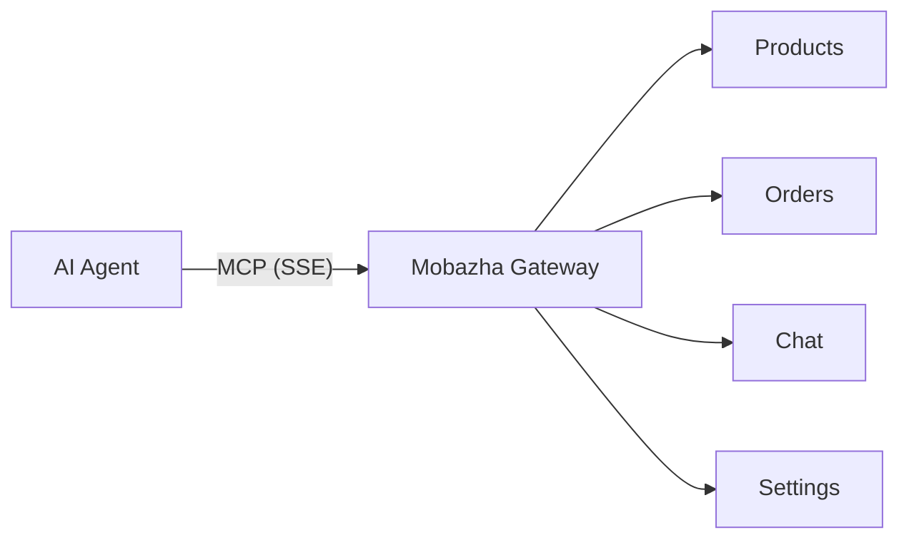

<div align="center">
  
  <h1>Mobazha Skills</h1>
  <p><strong>AI-powered skills for the Mobazha decentralized commerce platform</strong></p>
  <p>
    <a href="https://github.com/mobazha/mobazha-skills/actions/workflows/check.yml"></a>
    <a href="LICENSE"></a>
    <a href="https://clawhub.ai/fengzie/mobazha"></a>
  </p>
</div>

Deploy stores, import products from Shopify/Amazon, generate descriptions, optimize conversions, and manage your entire business — all through your AI coding agent with 30+ MCP tools.

## Quick Start

Install the plugin, then ask your AI agent:

> "Help me deploy a Mobazha store on my VPS"
>
> "Import my Shopify products into Mobazha"
>
> "Audit my store and tell me how to get more sales"

See [Installation](#installation) for setup instructions on your platform.

## Skills

### Deploy and Install

- **standalone-setup** — Deploy a self-hosted store on any VPS with Docker
- **native-install** — Install the native binary on Linux, macOS, or Windows
- **store-onboarding** — First-time setup: admin password, store profile, region/currency

### Configure and Connect

- **subdomain-bot-config** — Set up a custom domain and Telegram Bot for your store
- **tor-browsing** — Configure Tor Browser to access .onion stores privately
- **store-mcp-connect** — Connect your AI agent to your store via MCP for direct management

### Operate and Grow

- **store-management** — Manage products, orders, chat, discounts via 30+ MCP tools
- **product-import** — Bulk import products from Shopify, Amazon, or Etsy (CSV, API, or JSON)
- **competitor-analysis** — Research competitor products, reviews, and pricing

### Content and Marketing

- **product-description** — Generate SEO-optimized, conversion-focused product descriptions
- **store-copywriting** — Write compelling store profile, About section, and campaign copy
- **storefront-cro** — Audit your storefront and get prioritized conversion optimization tips
- **product-image-prompt** — Craft AI image prompts for product photos and store branding

## Store Modes

| Mode | Best For | Getting Started |
|------|----------|----------------|
| **SaaS** | Quick start, no server | Sign up at `app.mobazha.org` |
| **VPS Standalone** | Full control, custom domain | Follow `standalone-setup` skill |
| **NAT / Local** | Personal use, development | Follow `native-install` skill |

## MCP Integration

Connect your AI agent directly to your store's API via the [Model Context Protocol](https://modelcontextprotocol.io/).



Once connected, your agent can:

- Create, update, and delete products
- View and process orders (confirm, fulfill, refund)
- Send messages to buyers
- Manage discounts and collections
- Check notifications and exchange rates

See the **store-mcp-connect** skill for setup instructions.

## Installation

### OpenClaw

```
openclaw plugins install mobazha
```

Also available on [ClawHub](https://clawhub.ai/fengzie/mobazha) — search "mobazha" to browse all 14 skills.

### Claude Code

```
/plugin install mobazha@claude-plugins-official
```

### Cursor

```
/add-plugin mobazha
```

### Codex CLI

```
codex marketplace add mobazha/mobazha-skills
```

<details>
<summary>More platforms (Copilot, Gemini, OpenCode)</summary>

### GitHub Copilot CLI

```
copilot plugin marketplace add mobazha/mobazha-skills
```

### Gemini CLI

```
gemini extensions install https://github.com/mobazha/mobazha-skills
```

### OpenCode

Add to your `opencode.json`:

```json
{
  "plugin": ["mobazha@git+https://github.com/mobazha/mobazha-skills.git"]
}
```

</details>

## What You Can Ask

Once installed, your AI agent automatically discovers Mobazha skills:

- "Help me deploy a Mobazha store on my VPS"
- "Walk me through the store setup wizard"
- "Connect to my store and list my products"
- "Import my Shopify products into Mobazha"
- "Check my recent orders and fulfill the pending ones"
- "Set up a custom domain and Telegram bot for my store"
- "Write a better description for my handmade leather wallets"
- "Generate product photo prompts for my candle collection"
- "Analyze the competition on Etsy for organic skincare"

The agent loads the relevant skill and walks you through the process step by step.

## Contributing

See [CONTRIBUTING.md](CONTRIBUTING.md) for guidelines on adding or improving skills.

See [TESTING.md](TESTING.md) for how to verify skills against a real store.

## About Mobazha

[Mobazha](https://mobazha.org) is a decentralized commerce platform for independent sellers. Zero commissions, built-in escrow protection, crypto + fiat payments, and full data sovereignty.

[](https://mobazha.org)
[](https://t.me/MobazhaHQ)
[](https://mobazha.org/self-host)

## License

MIT License — see [LICENSE](LICENSE) for details.
